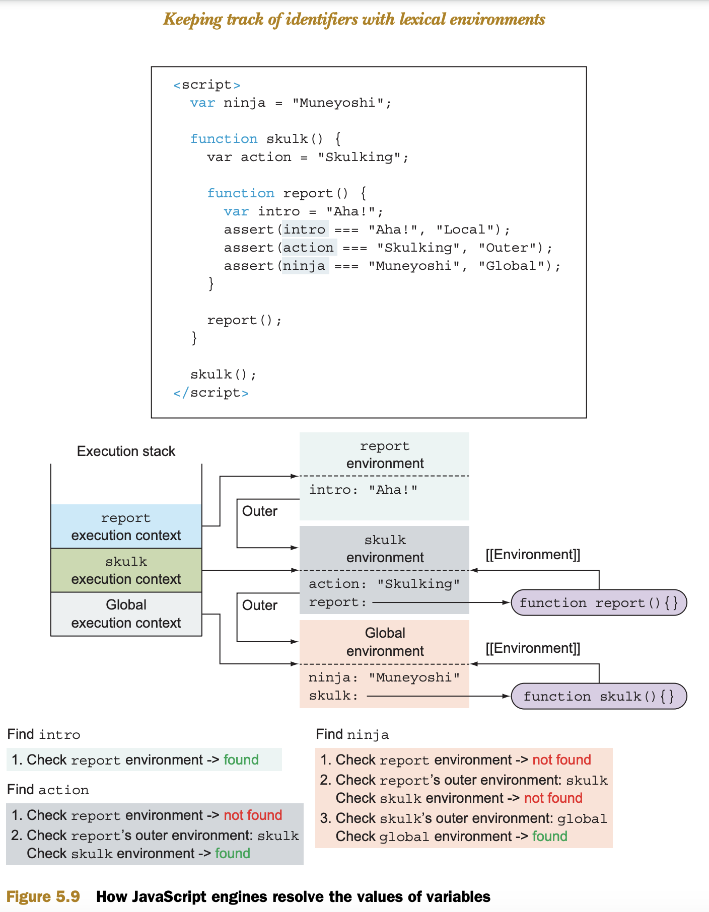

courses on educative - with assessments
https://www.educative.io/mycourses?filter_type=all
even udemy is not that bad

# Refer specs also. Not that difficult as you might think.

## good exercise solution pattern

https://frontendmasters.com/courses/js-fundamentals-functional-v2/
https://frontendmasters.com/courses/js-fundamentals-functional-v2/scope-walkthrough-part-1/ (scope)

There are two main types of JavaScript code:
**global** code, placed outside all functions, and
**function** code, contained in functions.

When our code is being executed by the JavaScript engine, each statement is executed in a certain execution context

we have two types of execution contexts:
**global execution context**
**function execution context**

There’s only one global execution context, created when our JavaScript program starts executing,
whereas a new function execution context is created on each function invocation.

Lexical environments are an internal implementation of the JavaScript scoping mechanism, and people often colloquially refer to them as _scopes_

Whenever a function is called, a new function execution context is created and pushed onto the execution context stack. In addition, a new associated lexical environment is created.

Page: 143

## data types

JavaScript only has primitive types and objects.

Primitive types are `boolean`, `null`, `undefined`, `bigint`, `number`, `string`, and `symbol`.

What differentiates a primitive from an object is that primitives do not have any properties or methods; however, you'll note that `'foo'.toUpperCase()` evaluates to `'FOO'` and does not result in a `TypeError`. This is because when you try to access a property or method on a primitive like a string, JavaScript will implicitly wrap the primitive type using one of the wrapper classes, i.e. `String`, and then immediately discard the wrapper after the expression evaluates. All primitives except for `null` and `undefined` exhibit this behaviour.

## event loop

This means that the JS Engine is just an on-demand execution environment for any arbitrary JS code.
So, for example, when your JavaScript program makes an Ajax request to fetch some data from the server, you set up the “response” code in a function (the “callback”), and the JS Engine tells the hosting environment:
“Hey, I’m going to suspend execution for now, but whenever you finish with that network request, and you have some data, please call this function back.”

It’s interesting to note that ES6 specifies how the event loop should work, meaning that technically it’s within the scope of the JS engine’s responsibilities, which is no longer playing just a hosting environment role. One main reason for this change is the introduction of Promises in ES6 because the latter require access to a direct, fine-grained control over scheduling operations on the event loop queue

## building the page at runtime

When the browser reaches the script node in the page-building phase, it pauses the DOM construction based on HTML code and starts executing JavaScript code instead.
