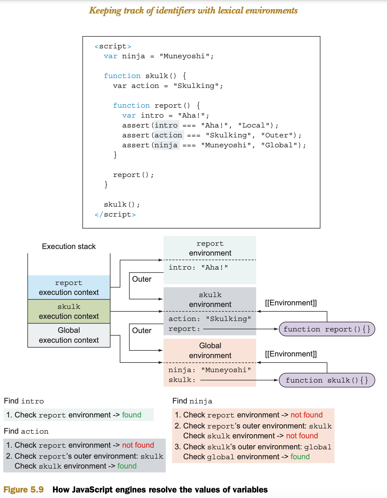

There are two main types of JavaScript code:
**global** code, placed outside all functions, and
**function** code, contained in functions.

When our code is being executed by the JavaScript engine, each statement is executed in a certain execution context

we have two types of execution contexts:
**global execution context**
**function execution context**

There’s only one global execution context, created when our JavaScript program starts executing,
whereas a new function execution context is created on each function invocation.

Lexical environments are an internal implementation of the JavaScript scoping mechanism, and people often colloquially refer to them as _scopes_

Whenever a function is called, a new function execution context is created and pushed onto the execution context stack. In addition, a new associated lexical environment is created.

Page: 143

--

Lexical Environment = Scope

The let declaration adds a something global variable but not a global object property. The effect then is that the something lexical identifier shadows the something global object property.

It’s almost certainly a bad idea to create a divergence between the global object and the global scope. Readers of your code will almost certainly be tripped up.

A simple way to avoid this gotcha with global declarations: always use var for globals. Reserve let and const for block scopes
https://leanpub.com/ydkjsy-scope-closures/read_sample

## Registering identifiers within lexical environments

It turns out that the JavaScript engine “cheats” a little, and that execution of JavaScript code occurs in two phases.

1. The first phase is activated whenever a new lexical environment is created. In this phase, the code isn’t executed, but the JavaScript engine visits and registers all declared variables and functions within the current lexical environment.
2. The second phase, JavaScript execution, starts after this has been accomplished; the exact behavior depends on the type of variable (let, var, const, function declaration) and the type of environment (global, function, or block).

??
In terms of scopes, each of these code structures gets an associated lexical environment every time the code is evaluated. For example, on every invocation of the skulk function, a new function lexical environment is created.

Each **execution context** has a **lexical environment** associated with it that contains the mapping for all identifiers defined directly in that context.

⭐️⭐️⭐️ Whenever a function is called, a new function execution context is created and pushed onto the execution context stack. In addition, a new associated lexical environment is created.

##

To do this, we have to somehow keep track of these outer environments. JavaScript does this
by taking advantage of functions as first-class objects. [[Environment]]

## block scope

a block is anything between {}

## scope WALKTHROUGH frontendmaster

https://frontendmasters.com/courses/js-fundamentals-functional-v2/scope-walkthrough-part-1/

## Lexical

In JavaScript, every running function, code block {...}, and the script as a whole have an internal (hidden) associated object known as the Lexical Environment.